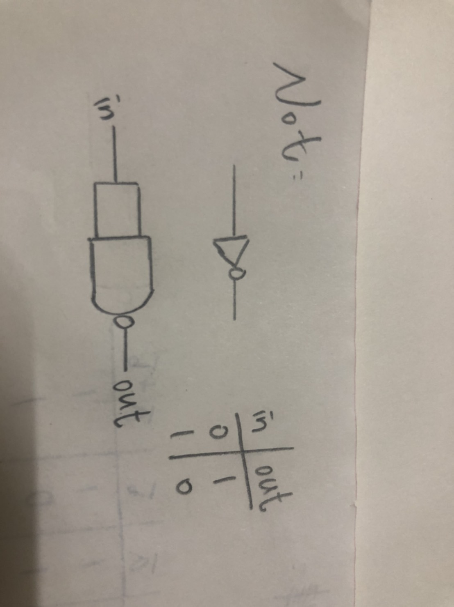
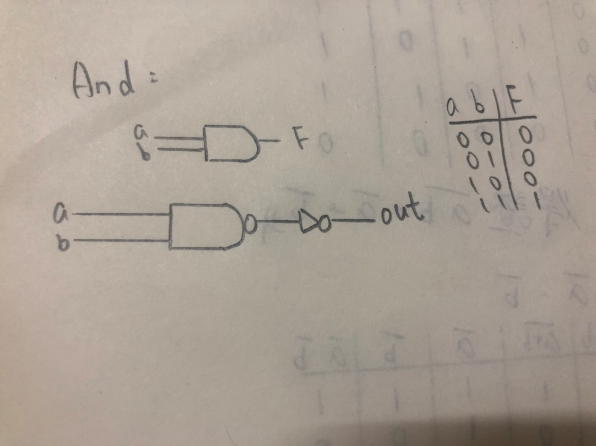
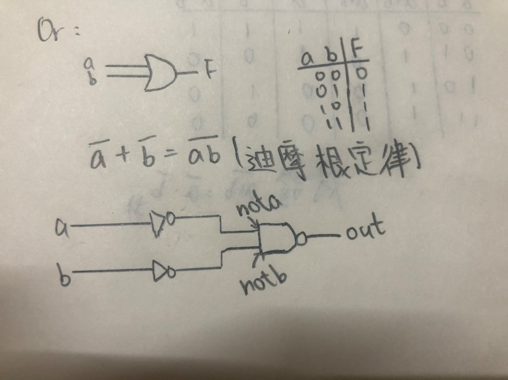
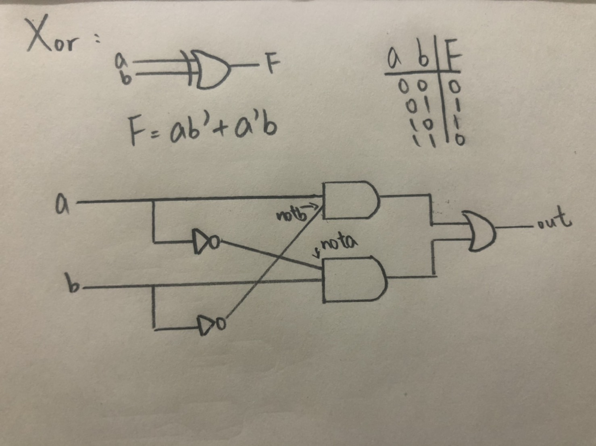
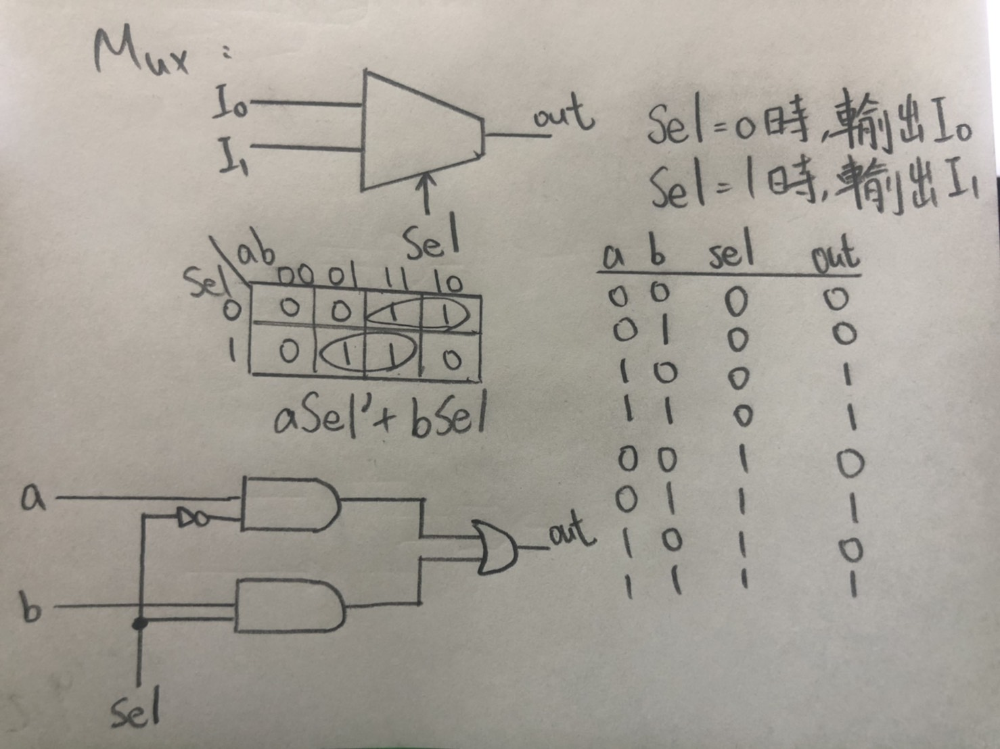
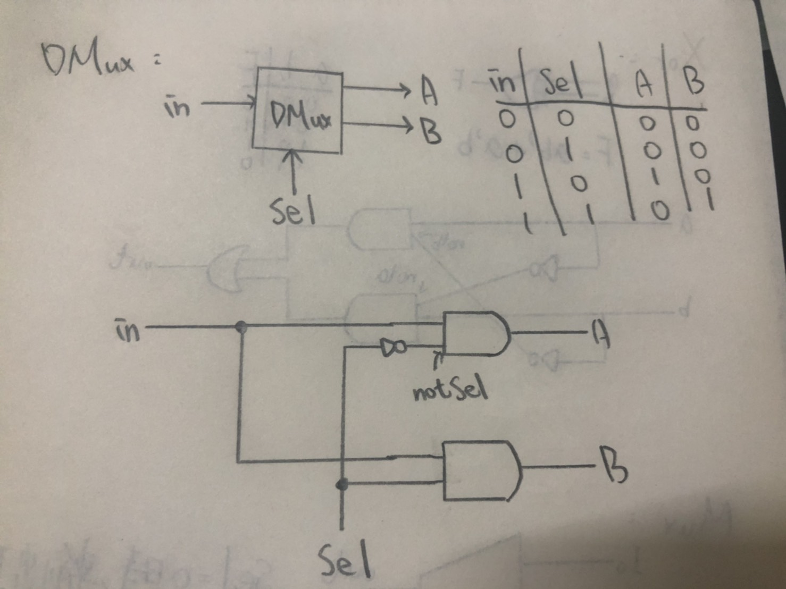

# 第一章前六題

### 1.Not 
* picture
 

* code
```
// This file is part of www.nand2tetris.org
// and the book "The Elements of Computing Systems"
// by Nisan and Schocken, MIT Press.
// File name: projects/01/Not.hdl

/**
 * Not gate:
 * out = not in
 */

CHIP Not {
    IN in;
    OUT out;

    PARTS:
    // Put your code here:
    Nand(a=in, b=in, out=out);
}
```

### 2.And
* picture
 

* code
```
// This file is part of www.nand2tetris.org
// and the book "The Elements of Computing Systems"
// by Nisan and Schocken, MIT Press.
// File name: projects/01/And.hdl

/**
 * And gate: 
 * out = 1 if (a == 1 and b == 1)
 *       0 otherwise
 */

CHIP And {
    IN a, b;
    OUT out;

    PARTS:
    // Put your code here:
        Nand(a=a, b=b, out=AnandB);
        Not(in=AnandB, out=out);
}
```

### 3.Or
* picture
 

* code
```
// This file is part of www.nand2tetris.org
// and the book "The Elements of Computing Systems"
// by Nisan and Schocken, MIT Press.
// File name: projects/01/Or.hdl

 /**
 * Or gate:
 * out = 1 if (a == 1 or b == 1)
 *       0 otherwise
 */

CHIP Or {
    IN a, b;
    OUT out;

    PARTS:
    // Put your code here:
    Not(in=a, out=NotA);
    Not(in=b, out=NotB);
    Nand(a=NotA, b=NotB, out=out);
}
```

### 4.Xor
* picture
 

* code
```
// This file is part of www.nand2tetris.org
// and the book "The Elements of Computing Systems"
// by Nisan and Schocken, MIT Press.
// File name: projects/01/Or.hdl

 /**
 // This file is part of www.nand2tetris.org
// and the book "The Elements of Computing Systems"
// by Nisan and Schocken, MIT Press.
// File name: projects/01/Xor.hdl

/**
 * Exclusive-or gate:
 * out = not (a == b)
 */

CHIP Xor {
    IN a, b;
    OUT out;

    PARTS:
    // Put your code here:
    Not(in=a, out=NotA);
    Not(in=b, out=NotB);
    And(a=a, b=NotB, out=AandNotB);
    And(a=NotA, b=b, out=NotAandB);
    Or(a=AandNotB, b=NotAandB, out=out);
} 
```

### 5.Mux
* picture
 

* code
```
// This file is part of www.nand2tetris.org
// and the book "The Elements of Computing Systems"
// by Nisan and Schocken, MIT Press.
// File name: projects/01/Mux.hdl

/** 
 * Multiplexor:
 * out = a if sel == 0
 *       b otherwise
 */

CHIP Mux {
    IN a, b, sel;
    OUT out;

    PARTS:
    // Put your code here:
    Not(in=sel, out=Notsel);
    And(a=a, b=Notsel, out=AandNotsel);
    And(a=b, b=sel, out=Bandsel);
    Or(a=AandNotsel, b=Bandsel, out=out);
}
```

### 6.DMux
* picture
 

* code
```
// This file is part of www.nand2tetris.org
// and the book "The Elements of Computing Systems"
// by Nisan and Schocken, MIT Press.
// File name: projects/01/DMux.hdl

/**
 * Demultiplexor:
 * {a, b} = {in, 0} if sel == 0
 *          {0, in} if sel == 1
 */

CHIP DMux {
    IN in, sel;
    OUT a, b;

    PARTS:
    // Put your code here:
    Not(in=sel, out=Notsel);
    And(a=in, b=Notsel, out=a);
    And(a=in, b=sel, out=b);
}
```
