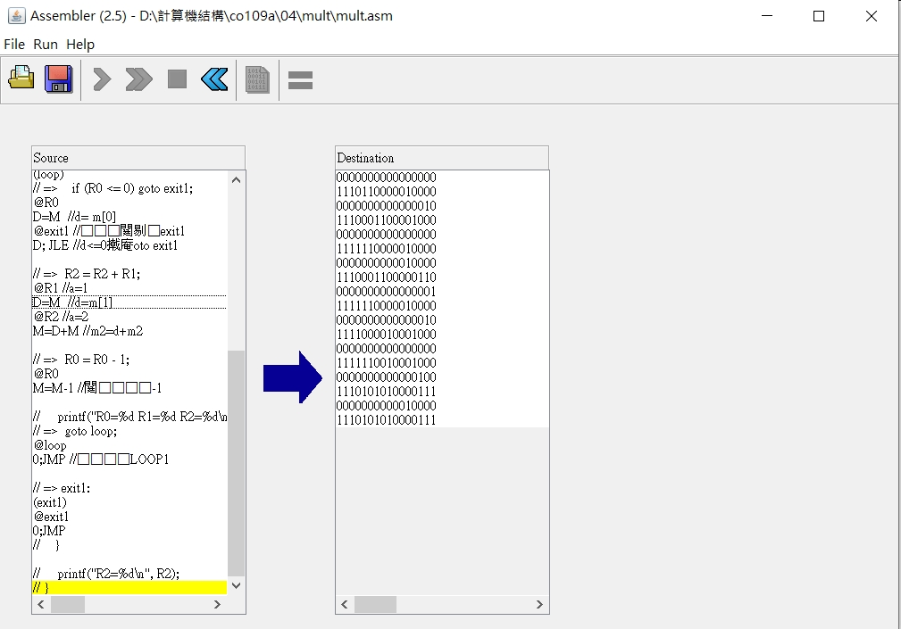

# 第四章第一題

1.Mult
* picture
 

* code
```
// This file is part of www.nand2tetris.org
// and the book "The Elements of Computing Systems"
// by Nisan and Schocken, MIT Press.
// File name: projects/04/Mult.asm

// Multiplies R0 and R1 and stores the result in R2.
// (R0, R1, R2 refer to RAM[0], RAM[1], and RAM[2], respectively.)

// Put your code here.
// #include <stdio.h>

// int main() {
//    int R0 = 3;
//    int R1 = 5;
// =>    int R2 = 0;
@0 //a設為0
D=A  //d=0
@R2 //a設為2
M=D //m[2]=d
//    while (R0 > 0) {
// => loop:
(loop)
// =>    if (R0 <= 0) goto exit1;
@R0
D=M  //d= m[0]
@exit1 //把a設為exit1
D; JLE //d<=0就goto exit1

// =>  R2 = R2 + R1;
@R1 //a=1
D=M  //d=m[1]
@R2 //a=2
M=D+M //m2=d+m2

// =>  R0 = R0 - 1;
@R0
M=M-1 //計數器-1

//     printf("R0=%d R1=%d R2=%d\n", R0, R1, R2);
// =>  goto loop;
@loop
0;JMP //回到LOOP1

// => exit1:
(exit1)
@exit1
0;JMP
//    }
    
//     printf("R2=%d\n", R2);
// }
```

result
* picture
 
